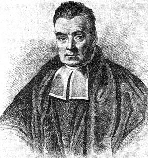

```{r setup, include=FALSE}
library(tidyverse)
library(skimr)
library(xaringanExtra)
knitr::opts_chunk$set(echo = TRUE)
knitr::opts_chunk$set(fig.dim=c(4.8, 4.5), fig.retina=2, out.width="100%", comment="#>")
theme_set(theme_minimal())
xaringanExtra::use_animate_css(xaringan = TRUE)
xaringanExtra::use_freezeframe()
swiss.train <- read_csv("../data/swiss-train.csv")
```

## Classification

Consider a dataset where every observation

- belongs to a particular category or 'class', with class membership is stored as a factor variable, and
- has values for one or more variables that are 'predictors' or 'features'.

--

The goal of classification is to

- with a training dataset, build a model of the relationship between the **predictors** and the **class**, and 
- use that model to predict class membership for new data, where the predictors are known but the class is not known.

--

This is basically a prediction problem, where the target variable is categorical. Many predictive modelling methods can be used for classification with only minor modifications.

--

Classification is sometimes referred to as '**supervised learning**'.

--

Applications include:

-   Biological taxonomy (assignment of organisms to species)
-   Diagnosis of disease
-   Assessment of credit risk
-   Forensics (classification of evidence)

---

## Goal of classification

The overarching goal is to use our model to estimate **classification probabilities**, $\mathsf{P}(\textrm{class} | \textrm{features})$,    
particularly for new data, where we only know the features and not the class.

--

We cannot expect our classifier model to achieve 'perfect' classification in most cases. We expect it to make some errors.

--

However, if some classes are more likely than others given the values of the features, then our classifier will do a better job than the alternative: randomly guessing the class.
-   Suppose we try to determine if a video on Netflix is from a TV series or a movie, based on it's length.
-   A video close to 2 hours long is more likely a movie, but not certainly.

--

Typically, we assign observation to class with highest classification probability.

--

Sometimes, however, the cost of making an incorrect classification can depend on the class. For example, in medical diagnosis, it is often worse to make a false negative (failing to diagnose the disease) than a false positive (falsely diagnosing the disease), so it is sensible to err on the side of caution. These sorts of costs can be incorporated into the predictions.


---

## Two broad approaches to classification

### Generative classifiers

-   Seek to learn the data-generating process and represent it with a joint probability model $\mathsf{P}(\textrm{class} , \textrm{predictors})$ 

-   With **Bayes theorem**, such a model can be used to generate probabilities
    $\mathsf{P}(\textrm{class} | \textrm{predictors})$ 


### Discriminative classifiers

-   Estimate $\mathsf{P}(\textrm{class} | \textrm{predictors})$ directly, with a focus on learning the boundaries in the predictor space that separate the classes

-   Also referred to as **conditional** classifiers

---

## Generative classifiers: Statistical Theory

-   Let's label the classes as $1, 2, \ldots, C$.

--

-   Let $\mathbf{x} = (x_1, x_2, \ldots, x_p)$ denote vector of features
    (predictor variables).

--

-   Let $f_j$ denote joint probability function of $\mathbf{x}$ for individuals
    in class $j$.

--

-   The probability function $f_j$ defines conditional probabilities of features
    for any given class.
    
$$f_j(\mathbf{x}) = \mathsf{P}(\mathbf{X} = \mathbf{x} | \mbox{class} = j)$$

--

-   Let $\pi_j$ denote marginal (or unconditional) probability of being
    in class $j$. This is often called the '**prior** probability' for class $j$.

---

## Classifying Bellbugs and Frongles

Renowned entomologist Professor Hamish McTwaddle has a collection of 1000 Bellbugs and Frongles.

Each insect is either blue or green, and has either one white stripe or two.

```{r, echo=FALSE}
bugs <- tribble(~Insect, ~Colour, ~Stripe, ~Count,
        "Bellbugs", "Blue", 1, 50,
        "Bellbugs", "Blue", 2, 20,
        "Bellbugs", "Green", 1, 230,
        "Bellbugs", "Green", 2, 300,
        "Frongles", "Blue", 1, 200,
        "Frongles", "Blue", 2, 150,
        "Frongles", "Green", 1, 20,
        "Frongles", "Green", 2, 30) |>
  mutate(Stripe = paste(Stripe, "stripe")) |>
  pivot_wider(names_from=c(Colour, Stripe), values_from=Count, names_sep=" ")
bugs |> knitr::kable()
```

If class $j=1$ is Bellbugs and $j=2$ is Frongles, then:
    
$\pi_1 = \mathsf{P}(\mbox{Bellbug}) = 600/1000 = 0.6$
$\ \ \ \ \pi_2 = \mathsf{P}(\mbox{Frongle}) = 400/1000 = 0.4$
$f_1(\mbox{Blue, 1 stripe}) = \mathsf{P}(\mbox{Blue, 1 stripe} | \, \mbox{Bellbug}) = 50/600=0.083$
$f_2(\mbox{Blue, 1 stripe}) = \mathsf{P}(\mbox{Blue, 1 stripe} | \, \mbox{Frongle}) = 200/400=0.5$
$f_1(\mbox{Green, 2 stripe}) = \mathsf{P}(\mbox{Green, 2 stripe} | \, \mbox{Bellbug}) = 300 / 600 = 0.5$
$f_2(\mbox{Green, 2 stripe}) = \mathsf{P}(\mbox{Green, 2 stripe} | \, \mbox{Frongle}) = 30 / 400 = 0.075$

---

## Bayes' Theorem

Classification probability for class $j$ given feature vector $\mathbf{x}$     is denoted by $\mathsf{P}(j | \mathbf{x})$ for $j=1,\ldots,C$.    
$\mathsf{P}(j | \mathbf{x})$ can be referred to as the **posterior** probability for class $j$ based on data $\mathbf{x}$.

We want to relate $\mathsf{P}(j | \mathbf{x})$ to $f_j(\mathbf{x})$ and $\pi_j$ for
    $j=1,\ldots,C$.

This can be done using Bayes' theorem:
    $$\mathsf{P}(j | \mathbf{x}) = \frac{ \pi_j f_j(\mathbf{x}) }{f(\mathbf{x})},\qquad j=1,\ldots,C$$
where $f(\mathbf{x}) = \sum_i \pi_i f_i(\mathbf{x})$ is the marginal probability
    function for $\mathbf{x}$.

Note that denominator in equation is same for all classes $j$.

Hence most probable class is the one for which $\pi_j f_j(\mathbf{x})$ is largest.

---

.left-code[

## Bayes' Theorem: an aside

Bayes' theorem is attributed to Rev. Thomas Bayes (1701--1761).

The theorem is incredibly important to modern statistics.
 
It permits the reversal of conditional probability statements.

It is the foundation of **Bayesian statistics**.
]

.right-plot[
```{r, echo=FALSE}

```
]

---

## More Bellbugs and Frongles

Based on the same table:

```{r, echo=FALSE}
bugs |> knitr::kable()
```

The probability that a *blue 1 stripe* insect is a Bellbug is given by:

$$\begin{aligned} P(\mbox{Bellbug} | \mbox{Blue, 1 stripe}) &= \frac{\pi_1 f_1(\mbox{Blue, 1 stripe})}{\pi_1 f_1(\mbox{Blue, 1 stripe}) + \pi_2 f_2(\mbox{Blue 1 stripe})}\\ &= \frac{0.6 \times 0.083}{0.6 \times 0.083 + 0.4 \times 0.5}\\ &= \frac{0.05}{0.05+0.20} = 0.2\end{aligned}$$

---

## More Bellbugs and Frongles

Based on the same table:

```{r, echo=FALSE}
bugs |> knitr::kable()
```

The probability that a *green 2 stripe* insect is a Frongle is given by:

$$\begin{aligned} P(\mbox{Frongle} | \mbox{Green, 2 stripe}) &= \frac{\pi_2 f_2(\mbox{Green, 2 stripe})}{\pi_1 f_1(\mbox{Green, 2 stripe}) + \pi_2 f_2(\mbox{Green 2 stripe})}\\ &= \frac{0.4 \times 0.075}{0.6 \times 0.5 + 0.4 \times 0.075}\\ &= \frac{0.03}{0.3+0.03} = 0.09\end{aligned}$$

---

## Error Rates

The performance of a classifier is usually measured by its **misclassification rate**.

The misclassification rate is the proportion of observations that the classifier
    assigned to the wrong class.

It is often useful to cross-tabulate the predicted classes versus the actual classes, preferably with a **validation** dataset that was not used to train the classifier. Such a table is called a **confusion matrix**.

Often, the aim is to build a classifier with the smallest possible misclassification rate.

If some mistakes are more important than others, we can choose to minimise the *weighted* misclassification rate, where different weights are assigned to the different ways to be wrong (e.g., if false negatives are more consequential than false positives in a medical diagnosis, then they'll be given greater weight).

---

## Designing generative classifiers

Recall that by Bayes' theorem,
    $$P(j | \mathbf{x}) = \frac{\pi_j f_j(\mathbf{x})}{f(\mathbf{x}) },$$ 
    
where $\ \ f(\mathbf{x}) = \sum_i \pi_i f_i(\mathbf{x})$

$\ \ \ \ \ \ \ \ \ \ \ \ \ \pi_j = \mathsf{P}(j)$ is the prior probability of being in class $j$

$\ \ \ \ \ \ \ \ \ \ \ \ \ f_j(\mathbf{x})$ is the probability function of features (predictors) for class $j$

--

How do we obtain prior probabilities $\pi_j$ and probability functions $f_j$ for $j=1, \ldots, C$ from the training data?

---

## Example: Swiss banknotes

.left-code[
Let's introduce a dataset of forged and genuine bank notes (the class variable, $C$), along with two features ( $\mathbf{x}$ ).

We have two datasets: a training dataset of 120 records and a testing dataset of 80 records.

The variables are:

-   `margin` (size of bottom margin, in mm)
-   `diagonal` (length of diagonal, in mm)
-   `type`, two level factor: forged or genuine

]

.right-plot[

```{r, message=FALSE}
swiss.train <- read_csv(
 "https://www.massey.ac.nz/~jcmarsha/data/swiss-train.csv"
 ) |> mutate(type = factor(type))

swiss.test <- read_csv(
 "https://www.massey.ac.nz/~jcmarsha/data/swiss-test.csv"
 ) |> mutate(type = factor(type))

swiss.train |> slice_head(n=4)

```
]

---

.left-code[
## Example: Swiss banknotes

```{r swissbox, eval=FALSE}
swiss.train |> 
  ggplot() +
  aes(x=type, y=margin) +
  geom_boxplot()
```

Observations:

-   Obvious difference between margin sizes for genuine and forged notes.

-   The probability distributions of `margin` for genuine *vs* forged notes could
be used as $f_j$. But how do we estimate these distributions from data? 

-   Options include:
    - assume a normal distribution, or 
    - use an empirical distribution function, such as a histogram or kernel density.
]

.right-plot[
```{r, ref.label="swissbox", echo=FALSE}
```
]

---

## How do we get the prior probabilities?

**We can estimate $\pi_j$ by relative frequency of class $j$ in the training data.**

-   This is a good idea if training data is representative of population
    of test cases.

-   For example, Professor McTwaddle collected insects at random from their natural habitat. The ratio 60:40 of Bellbugs to Frongles is representative of prevalence of these species, so $\pi_1 = \mathsf{P}(\mbox{Bellbug}) = 0.6$ is a sensible prior.

**But the relative frequency of classes in the training data is not always representative of the population.**

-   Sometimes, all cases of particular categories are included, whereas others are sub-sampled.

-   In these cases, we might need to obtain $\pi_j$ from elsewhere.

-   For example, in the Swiss banknote datasets, relative frequency of forged and genuine is about 50:50. If these are the true proportions of forged and genuine notes in general circulation, then Switzerland is in trouble!

    -   Setting $\pi_1 = \mathsf{P}(\mbox{forged}) = 0.5$ not a good idea in this case.

    -   We could ask police experts for an estimate of the prevalence of forged notes.

---

## Methods for estimating $f_j$ of numerical feature variables

**Linear discriminant analysis**: assume that the $f_j$ are normal probability densities. 

**Kernel discriminant analysis**: estimate $f_j$ using kernel density estimation

**Naive Bayes**: assume feature variables are independent, allowing the joint probability functions to be factorised to make estimation easier. 

---

class: middle, inverse

# Linear Discriminant Analysis

---

## Linear Discriminant Analysis (LDA)

LDA can be used when all the features are quantifiable.

We assume that 
-   $f_j$ is a (joint) normal probability distribution, and

-   the covariance matrix is the same for all classes.

The classes are differentiated by locations of their means.

---

## Linear Discriminant Analysis (LDA): one feature and two classes

.left-code[

Suppose we have just $p=1$ feature $(x)$ and $C=2$ classes.

Assume that each $f_j(x)$ (for $j=1,2$) is a normal distribution with a different mean and a common variance.

Based on training data, we estimate:

-   Common variance $\sigma^2 = s^2$
-   Mean for class 1 $\mu_1 = \bar x_1$
-   Mean for class 2 $\mu_2 = \bar x_2$

Hence, the underlying model is   
$\ \ f_1 = \mathsf{Normal}(\bar x_1, s^2)$ and $\ \ f_2 = \mathsf{Normal}(\bar x_2, s^2)$.

Assume the classes have equal prior probability: $\pi_1 = \pi_2 = 0.5$.
]

.right-plot[

```{r  echo=FALSE, warning=FALSE, fig.dim=c(5,3.5)}
xx <- tibble(x=c(8,8.2,8.8,9,9.3,9.6,10,10.2,10.8,11,11.6,12),
       Class=factor(c(1,1,1,1,1,2,1,2,2,2,2,2))) 

xx_means <- xx |> group_by(Class) |> summarise(mean=mean(x))
xx_sd <- summary(lm(x~Class,data=xx))$sigma

xx_dnorm <- tibble(x=seq(6,14,length=100)) |> 
  mutate(`1` = dnorm(x=x, 
                     mean=pull(xx_means[1,"mean"]),
                     sd=xx_sd),
         `2` = dnorm(x=x, 
                     mean=pull(xx_means[2,"mean"]),
                     sd=xx_sd)) |> 
  pivot_longer(`1`:`2`, names_to = "Class") |> 
  mutate(Class=factor(Class))

ldax <- xx |> 
  ggplot() +
  aes(x=x, group=Class, col=Class, fill=Class, pch=Class) +
  geom_point(mapping=aes(y=0), size=3) +
  geom_area(data=xx_dnorm, 
            mapping=aes(x=x,y=value,group=Class,col=Class),
            position = "identity",
            alpha=.2) +
  geom_segment(data=xx_means,
               mapping = aes(x=mean,xend=mean,
                             y=0,yend=max(xx_dnorm$value),
                             col=Class)) +
  ylab("Density") + xlab(expression(italic(x))) +
  theme(axis.title.x = element_text(family = "serif"),
        legend.position = c(0.9, 0.85)) +
  # ylim(0,.5) + 
  # xlim(6.2,14) +
  annotate(geom="text",7.1,.2,parse = TRUE,
           label = expression(italic(hat(f)[1](italic(x)))),
           family="serif", size=6) +
  annotate(geom="text",12.7,.2,parse = TRUE,
           label = expression(italic(hat(f)[2](italic(x)))),
           family="serif", size=6)

ldax

```

]

---

## Classifying a test case

Test case $0$ has feature value $x_0$. How should it be classified?

From Bayes' theorem, posterior probability for class $j$ is 

$\ \ \ P(j | \, x_0) = \frac{\pi_j f_j(x_0)}{f(x_0) }.$

We assign the test case to class 1 if and only if 

$\ \ \ \mathsf{P}(1 | \, x_0) > \mathsf{P}(2 | \, x_0)$ 

or, equivalently,

$\ \ \ \pi_1 f_1(x_0) > \pi_2 f_2(x_0)$.

If we assume $\pi_1 = \pi_2 = 0.5$, we assign the test case to class 1 if $f_1(x_0) > f_2(x_0)$.

---

## Classifying a test case

Normal probability function is given by
$$f(x) = \frac{1}{\sqrt{2 \pi} \sigma} e^{ - (x - \mu)^2/(2 \sigma^2) }$$

Hence:

$$\begin{aligned}f_1(x_0) > f_2(x_0) &\Leftrightarrow& \frac{1}{\sqrt{2 \pi} s} e^{ - (x_0 - \bar x_1)^2/(2 s^2) } > \frac{1}{\sqrt{2 \pi} s} e^{ - (x_0 - \bar x_2)^2/(2 s^2) }\\&\Leftrightarrow& e^{ - (x_0 - \bar x_1)^2/(2 s^2) } > e^{ - (x_0 - \bar x_2)^2/(2 s^2) }\\&\Leftrightarrow&  - (x_0 - \bar x_1)^2/(2 s^2)  >  - (x_0 - \bar x_2)^2/(2 s^2) \\&\Leftrightarrow&   (x_0 - \bar x_1)^2  <   (x_0 - \bar x_2)^2 \\&\Leftrightarrow&   |x_0 - \bar x_1|  <   |x_0 - \bar x_2| \\\end{aligned}$$

---

## Classifying a test case

.left-code[

For equal prior probabilities, we assign the test case to class 1 if $x_0$ is closer to $\bar x_1$ than it is to $\bar x_2$; in other words, if     
    $\ \ \ \ \ \ |x_0 - \bar x_1|  <   |x_0 - \bar x_2|$     
or, equivalently,      
    $\ \ \ \ \ \ x_0 < (\bar x_1 + \bar x_2)/2$.

This can be thought of as there being a decision boundary where one group becomes more probable than the other. 

]

.right-plot[

```{r  echo=FALSE, warning=FALSE, fig.dim=c(5,3.5)}
ldax +
  geom_vline(xintercept=mean(xx_means$mean), lwd=1.5) +
  geom_label(aes(x = mean(xx_means$mean), y = 0.52, 
                 label = "Decision boundary"), fill = "white", col=1)


```

]

---

## Classifying a test case

.left-code[

For equal prior probabilities, we assign the test case to class 1 if $x_0$ is closer to $\bar x_1$ than it is to $\bar x_2$; in other words, if     
    $\ \ \ \ \ \ |x_0 - \bar x_1|  <   |x_0 - \bar x_2|$     
or, equivalently,      
    $\ \ \ \ \ \ x_0 < (\bar x_1 + \bar x_2)/2$.

This can be thought of as there being a decision boundary where one group becomes more probable than the other. 

With $C \ge 3$ classes, we have more than one boundaries.

For two or more features:       
- Classes are assumed to have a common variance-covariance matrix.    
- Boundaries are lines for two features, and planes or 'hyperplanes' for three or more features.

]

.right-plot[

```{r  echo=FALSE, warning=FALSE, fig.dim=c(5,3)}
xxx <- tibble(x=c(8,8.2,8.8,9,9.3,9.6,10,10.2,10.8,11,11.6,12,12.8,13,13.6,14),
              Class=factor(c(1,1,1,1,1,2,1,2,2,2,2,2,3,3,3,3))) 

xxx_means <- xxx |> group_by(Class) |> summarise(mean=mean(x))
xxx_sd <- summary(lm(x~Class,data=xxx))$sigma

xxx_dnorm <- tibble(x=seq(6,16,length=100)) |> 
  mutate(`1` = dnorm(x=x, 
                     mean=pull(xxx_means[1,"mean"]),
                     sd=xx_sd),
         `2` = dnorm(x=x, 
                     mean=pull(xxx_means[2,"mean"]),
                     sd=xx_sd),
         `3` = dnorm(x=x, 
                     mean=pull(xxx_means[3,"mean"]),
                     sd=xx_sd)) |> 
  pivot_longer(`1`:`3`, names_to = "Class") |> 
  mutate(Class=factor(Class))

ldaxxx <- xxx |> 
  ggplot() +
  aes(x=x, group=Class, col=Class, fill=Class, pch=Class) +
  geom_point(mapping=aes(y=0), size=3) +
  geom_area(data=xxx_dnorm, 
            mapping=aes(x=x,y=value,group=Class,col=Class),
            position = "identity",
            alpha=.2) +
  geom_segment(data=xxx_means,
               mapping = aes(x=mean,xend=mean,
                             y=0,yend=max(xxx_dnorm$value),
                             col=Class)) +
  ylab("Density") + xlab(expression(italic(x))) +
  theme(axis.title.x = element_text(family = "serif"),
        legend.position = c(0.9, 0.85)) +
  # ylim(0,.5) + 
  # xlim(6.2,14) +
  annotate(geom="text",pull(xxx_means[1,"mean"]),.52,parse = TRUE,
           label = expression(italic(hat(f)[1](italic(x)))),
           family="serif", size=4) +
  annotate(geom="text",pull(xxx_means[2,"mean"]),.52,parse = TRUE,
           label = expression(italic(hat(f)[2](italic(x)))),
           family="serif", size=4) +
  annotate(geom="text",pull(xxx_means[3,"mean"]),.52,parse = TRUE,
           label = expression(italic(hat(f)[3](italic(x)))),
           family="serif", size=4) +
  geom_vline(xintercept=mean(pull(xxx_means[1:2,"mean"])), lwd=1.5) +
  geom_vline(xintercept=mean(pull(xxx_means[2:3,"mean"])), lwd=1.5)


ldaxxx

```

]


---

## LDA separates the classes with hyperplanes

```{r, echo=FALSE, fig.dim=c(7,3.5)}
par(mar=c(4,4,2,2), mfrow=c(1,2))
plot((-1):2,(-1):2,type="n",xlab=expression(x[1]),ylab=expression(x[2]), asp=1)
polygon(c(-3,-3,4),c(4,-3,-3),col=8)
polygon(c(4,4,-3),c(-3,4,4),col=5)
lines(c(-3,4),c(4,-3),lwd=2)
points(0,0,pch=19,col=1)
points(1,1,pch=19,col=4)
text(0,-0.15,expression(mu[1]),cex=1.5)
text(1,1.15,expression(mu[2]),cex=1.5)

plot((-2):2,(-1):3,type="n",xlab=expression(x[1]),ylab=expression(x[2]), asp=1)
lines(c(-3,0),c(-2,1),lwd=2)
lines(c(0,3),c(1,-2),lwd=2)
lines(c(0,0),c(1,4),lwd=2)
polygon(c(-5,-5,0,0),c(-4,4,4,1),col=5)
polygon(c(5,5,0,0),c(-4,4,4,1),col="pink")
polygon(c(-5,0,5),c(-4,1,-4),col=8)
points(0,0,pch=19,col=1)
points(1,1,pch=19,col=2)
points(-1,1,pch=19,col=4)
text(0,0.2,expression(mu[1]),cex=1.5)
text(1,1.2,expression(mu[2]),cex=1.5)
text(-1,1.2,expression(mu[3]),cex=1.5)
```

---

## Different priors: The hyperplanes shift to favour more likely classes

```{r, echo=FALSE, fig.dim=c(7,3.5)}
par(mfrow=c(1,2), mar=c(4,4,2,2))
plot((-1):2,(-1):2,type="n",xlab=expression(x[1]),ylab=expression(x[2]))
polygon(c(-3,-3,4),c(4,-3,-3),col=8)
polygon(c(4,4,-3),c(-3,4,4),col=5)
lines(c(-3,4),c(4,-3),lwd=2)
points(0,0,pch=19,col=1)
points(1,1,pch=19,col=4)
text(0,-0.15,expression(mu[1]),cex=1.5)
text(1,1.15,expression(mu[2]),cex=1.5)
title(expression(paste(pi[1],"=",pi[2],"=1/2")),cex.main=1.5)
plot((-1):2,(-1):2,type="n",xlab=expression(x[1]),ylab=expression(x[2]))
polygon(c(-3,-3,4),c(4,-3,-3)+log(2),col=8)
polygon(c(4,4,-3),c(-3+log(2),4+log(2),4+log(2)),col=5)
lines(c(-3,4),c(4+log(2),-3+log(2)),lwd=2)
points(0,0,pch=19,col=1)
points(1,1,pch=19,col=4)
text(0,-0.15,expression(mu[1]),cex=1.5)
text(1,1.15,expression(mu[2]),cex=1.5)
title(expression(paste(pi[1],"=2",pi[2],"=2/3")),cex.main=1.5)
```

---

## Linear Discriminant Analysis in R

Linear discriminant analysis is implemented using `lda` function in R.

We will use the `discrim_linear()` wrapper function available in the`parsnip` add-on package `discrim`.

Prior probabilities can be specified using the `prior` argument to `set_engine()`. The proportions in the data are used unless other priors are specified.

Classification of test cases is done using `predict` or `augment` in the usual manner.

The `conf_mat()` function from `yardstick` can be used to evaluate performance. In addition the `accuracy()` function gives classification rates.

---

## LDA for forged banknotes

.left-code[


```{r swisslda, eval=TRUE, message=FALSE, warning=FALSE}
library(discrim)
library(yardstick)

swiss.lda <- discrim_linear() |>
  fit(type ~ ., data=swiss.train)

```

The `swiss.lda` object is a `parsnip` model
and drops out the underlying `lda` information.

Priors and group means have been estimated.

The coefficients of linear discriminants define
a matrix transformation from the scaled features
to the discriminants.
]

.right-plot[
```{r}
swiss.lda
```
]

---

## LDA for forged banknotes

.left-code[

`augment()` provides a `.pred_class` column
with the predictions.

The `.pred_forged` and `.pred_genuine` columns are posterior probabilities
of each class.

The overall classification rate is extremely good. This is an easy problem for LDA!
]

.small-font[

.right-plot[

```{r swisslda2, eval=TRUE}
swiss.pred <- swiss.lda |> augment(new_data=swiss.test)

swiss.pred

swiss.pred |> conf_mat(truth=type, estimate=.pred_class)
```

]

]

---

.left-code[
## Visualising the classifier

This is a very easy problem for LDA
to solve.

- The classes are very clearly separated.

- They have roughly the same variance (but perhaps different covariances?)

- A bivariate normal distribution isn't clearly awful.

**LDA makes strong assumptions and, when they hold, it does well.**
]

.right-plot[
```{r, echo=FALSE}
find_lin_disc <- expand_grid(
  margin=c(6.5, 14),
  diagonal=seq(135,145,length=1000)
  )

lin_disc <- swiss.lda |> 
  augment(new_data=find_lin_disc) |>
  mutate(diff = abs(.pred_forged - .pred_genuine)) |>
  group_by(margin) |>
  slice_min(diff, n=1) |> 
  ungroup()

swiss.all <- bind_rows(list(test=swiss.test, 
                            train=swiss.train), .id='data')

ggplot(swiss.all) +
  geom_point(mapping=aes(x=margin, y=diagonal, col=type, alpha=data)) +
  geom_line(data=lin_disc,mapping=aes(x=margin, y=diagonal)) +
  scale_alpha_manual(values = c(test=1, train=0.3))
```
]

---

.left-code[
## LDA dislikes jam donuts

```{r, echo=FALSE, message=FALSE}
donut.train <- read.csv("../data/donut-train.csv") |>
  mutate(Class = factor(Class, levels=1:2, labels=c("donut", "jam")))
```

```{r}
donut.lda.fit <-
  discrim_linear() |>
  fit(Class ~ ., 
      data=donut.train) |>
  augment(new_data=donut.train)

donut.lda.fit |>
  conf_mat(truth=Class,
           estimate=.pred_class)
```

Accuracy is just `r donut.lda.fit |> accuracy(truth=Class, estimate=.pred_class) |> pull(.estimate) |> round(digits=2)`.

About as bad as tossing a coin. With home-ground advantage!
]

.right-plot[
```{r, echo=FALSE}
ggplot(donut.train) +
  geom_point(mapping=aes(x=x1, y=x2, col=Class)) +
  scale_colour_manual(values = c(donut='tan', jam='red3'))
```
]

---

class: middle, inverse

# Kernel discriminant analysis

---


.left-code[
## Kernel Density Estimation

Given some values of $x$, we can use KDE to estimate density $\hat f(x)$.
    
For one dimensional $x$, we use $$\hat{f}(x) = \frac{1}{n}\sum_{i=1}^n \frac{1}{h}K(\frac{x - x_i}{h}),$$ where $h$ is the bandwidth (smoothing amount), and $K$ is the kernel, typically a Gaussian.
    
We can think of KDE as putting a little normal distribution on each data point, and then summing all those distributions up.

Can extend to higher dimensions, though $h$ then becomes a bandwidth matrix.

]


```{r include=FALSE}
v <- c(8.2,9,9.3,9.5,9.6,10,10.8)

xkd <- expand_grid(x = seq(6,13,length=100),
            vals = v) |> 
  mutate(y=dnorm(x,mean=vals,sd=.5)/7) |> 
  arrange(vals) |> 
  group_by(x) |> 
  mutate(ycum = cumsum(y)) |> 
  ungroup() |> 
  mutate(y1 = y) |> 
  mutate(y2 = if_else(vals == v[2], ycum, 
                      if_else(vals < v[2], NA, y))) |> 
  mutate(y3 = if_else(vals == v[3], ycum,  
                      if_else(vals < v[3], NA, y))) |> 
  mutate(y4 = if_else(vals == v[4], ycum,  
                      if_else(vals < v[4], NA, y))) |> 
  mutate(y5 = if_else(vals == v[5], ycum,  
                      if_else(vals < v[5], NA, y))) |> 
  mutate(y6 = if_else(vals == v[6], ycum,  
                      if_else(vals < v[6], NA, y))) |> 
  mutate(y7 = if_else(vals == v[7], ycum, NA))

xkdtotal <- xkd |> 
    summarise(ytotal = sum(y), .by = x)

```

--

.right-plot[
```{r static1, echo=FALSE}
library(gganimate)
library(gifski)

static <- xkd |> 
  pivot_longer(cols = y1:y7) |> 
  ggplot() +
  aes(x=x, y=y, group=factor(vals)) +
  geom_point(mapping=aes(x=vals, y=0), size=3, inherit.aes = F) +
  theme(legend.position="none") +
  ylab("Density") + xlab(expression(italic(x))) +
  theme(axis.title.x = element_text(family = "serif")) + 
  ylim(0,.5) + xlim(6,13)

static

```
]

---


.left-code[
## Kernel Density Estimation

Given some values of $x$, we can use KDE to estimate density $\hat f(x)$.
    
For one dimensional $x$, we use $$\hat{f}(x) = \frac{1}{n}\sum_{i=1}^n \frac{1}{h}K(\frac{x - x_i}{h}),$$ where $h$ is the bandwidth (smoothing amount), and $K$ is the kernel, typically a Gaussian.
    
We can think of KDE as putting a little normal distribution on each data point, and then summing all those distributions up.

Can extend to higher dimensions, though $h$ then becomes a bandwidth matrix.

]

.right-plot[
```{r static2, echo=FALSE}
library(gganimate)
library(gifski)

static +
  geom_area(mapping=aes(fill=factor(vals)), 
            position="identity", alpha=.2, col=1) +
  geom_point(mapping=aes(x=vals, y=0), size=3, inherit.aes = F) 


```
]

---

.left-code[
## Kernel Density Estimation

Given some values of $x$, we can use KDE to estimate density $\hat f(x)$.
    
For one dimensional $x$, we use $$\hat{f}(x) = \frac{1}{n}\sum_{i=1}^n \frac{1}{h}K(\frac{x - x_i}{h}),$$ where $h$ is the bandwidth (smoothing amount), and $K$ is the kernel, typically a Gaussian.

We can think of KDE as putting a little normal distribution on each data point, and then summing all those distributions up.

Can extend to higher dimensions, though $h$ then becomes a bandwidth matrix.

]

.right-plot[
```{r anim1, echo=FALSE, warning=FALSE}
xkd |> 
  pivot_longer(cols = y1:y7) |> 
  ggplot() +
  aes(x=x, y=value, group=factor(vals)) +
    geom_area(mapping=aes(fill=factor(vals)), 
              alpha=.2, col=1, position="identity") +
  # geom_area(position="identity", alpha=.2, col=1) +
  geom_point(mapping=aes(x=vals, y=0), size=3, inherit.aes = F) +
  theme(legend.position="none") +
  ylab("Density") + xlab(expression(italic(x))) +
  theme(axis.title.x = element_text(family = "serif")) + 
  ylim(0,.5) + xlim(6,13) +
  transition_states(name,
                    transition_length = 4,
                    state_length = 5, wrap=FALSE 
                    )


# animate(anim, renderer = gifski_renderer())

```

]

---

.left-code[
## Kernel Density Estimation

Given some values of $x$, we can use KDE to estimate density $\hat f(x)$.
    
For one dimensional $x$, we use $$\hat{f}(x) = \frac{1}{n}\sum_{i=1}^n \frac{1}{h}K(\frac{x - x_i}{h}),$$ where $h$ is the bandwidth (smoothing amount), and $K$ is the kernel, typically a Gaussian.

We can think of KDE as putting a little normal distribution on each data point, and then summing all those distributions up.
   
Can extend to higher dimensions, though $h$ then becomes a bandwidth matrix.

]

.right-plot[
```{r echo=FALSE, warning=FALSE}
static +
  geom_area(mapping=aes(fill=factor(vals)), 
            position = position_stack(reverse = T), 
            alpha=.2) +
  geom_area(data = xkd |> 
              pivot_longer(cols = y1:y7) |> 
              filter(vals == max(vals)),
            mapping=aes(x=x, y=ycum),
            alpha=0.1,col=1,lwd=2) +
  annotate(geom="text",11.5,.3,parse = TRUE,
           label = expression(italic(hat(f)(italic(x)))),
           family="serif", size=10)

```

]


---

## Kernel Discriminant Analysis

.left-code[

For discriminating among groups $j$, we can do kernel density estimation on each group to obtain $\hat f_j(\mathbf{x})$ 

The posterior probabilities that test case $\mathbf{x}_0$ belongs to group $j$ is found directly via Bayes' theorem

$$\mathsf{P}(j | \mathbf{x}_0) = \frac{ \pi_j \hat f_j(\mathbf{x}_0) }{\sum_i \pi_i \hat f_i(\mathbf{x}_0)}\qquad$$ 

for $j=1,\ldots,C$

Typically, we assign test case to class for which $\mathsf{P}(j | \mathbf{x}_0)$ is highest.
]

.right-plot[

```{r  echo=FALSE, warning=FALSE, fig.dim=c(5,3.5)}
xx |> 
  ggplot() +
  aes(x=x, group=Class, col=Class, fill=Class, pch=Class) +
  geom_point(mapping=aes(y=0), size=3) +
  geom_density(alpha=.2) +
  # theme(legend.position="none") +
  ylab("Density") + xlab(expression(italic(x))) +
  theme(axis.title.x = element_text(family = "serif"),
        legend.position = c(0.9, 0.85)) +
  ylim(0,.5) + xlim(6.2,14) +
  annotate(geom="text",7.2,.3,parse = TRUE,
           label = expression(italic(hat(f)[1](italic(x)))),
           family="serif", size=6) +
  annotate(geom="text",12.6,.3,parse = TRUE,
           label = expression(italic(hat(f)[2](italic(x)))),
           family="serif", size=6)

```

]

---

## Kernel Discriminant Analysis in R

We use `discrim_kernel()` from the `tidykda` package.

This package wraps the `kda` function from the `ks` library for use with
`tidymodels`. It is new, so you need to install it from Github via:

```{r, eval=FALSE}
remotes::install_github('jmarshallnz/tidykda')
```

It can be quite slow to run for large datasets.

The `discrim_kernel()` function allows at most 3 numeric predictors.

---

.left-code[
## KDA for Swiss Banknotes

Let's fit a kernel discriminant model
with `discrim_kernel()` from `tidykda`.

```{r}
library(tidykda)
swiss.kda <- discrim_kernel() |>
  fit(type ~ ., data=swiss.train)

swiss.kda |>
  augment(new_data=swiss.test) |>
  conf_mat(truth=type,
           estimate=.pred_class)
```

Misclassification rate is $1/80 = 1.25\%$, 
which is the same as LDA (on what is an easy problem).
]

.right-plot[
```{r, echo=FALSE}
ggplot(swiss.all,
       mapping=aes(x=margin, y=diagonal, col=type)) +
  geom_point(mapping=aes(alpha=data)) +
  geom_density_2d(data=swiss.train, alpha=0.5) +
  scale_alpha_manual(values = c(test=1, train=0.3))
```
]

---

.left-code[
## Kernel Discriminant Analysis for Donuts

How about the difficult donut problem?

```{r}
discrim_kernel() |>
  fit(Class ~ ., 
      data=donut.train) |>
  augment(new_data=donut.train) |>
  conf_mat(truth=Class,
           estimate=.pred_class)
```

Kernel discriminant analysis does much better than 
linear discriminant analysis here, 
because the boundary between classes is highly non-linear!
]

.right-plot[
```{r, echo=FALSE}
ggplot(donut.train, mapping=aes(x=x1, y=x2, col=Class)) +
  geom_point(alpha=0.02) +
  geom_density_2d(data=donut.train |> filter(Class == "donut")) +
  geom_density_2d(data=donut.train |> filter(Class == "jam")) +
  scale_colour_manual(values = c(donut='tan', jam='red3'))
```
]

---

## Curse of Dimensionality

KDA can work very well when number of features, $p$, is quite small.

KDA is more generally applicable than LDA because it does not make strong
    assumptions about form of $f_j$.

For high numbers of predictors (say $p > 3$), problems arise because of
    the **curse of dimensionality**.

As the dimensionality increases, we need exponentially greater sample
    sizes to give reliable kernel density estimates.

Further, storing the estimates requires exponentially greater memory, as they are evaluated on a grid.
    
- Predictions for new observations are computed by interpolating from that grid.

- Alternatively, we can store all the training data and bandwidth information and calculate densities 'on the fly'.

---

## Curse of Dimensionality

**High-dimensional space is a very lonely place.**

--

Suppose we have $p = 10$ predictors. 

--

We want to estimate $f_j(\mathbf{x})$ using histograms.

--

We divide range of each predictor into 10 intervals. 

--

... then there are $10^{10}$ = 10 billion bins!

--

So, to build our histogram, we need to estimate $10^{10}$ probabilities! 

--


It is very difficult to get a good estimate of probability (relative frequency) for each bin. 

- Even with a training set of millions, most bins will be empty.

- Even if we divided each predictor into only 2 bins each, we'd have $2^{10} = 1024$ bins in total. This might be manageable in terms of estimation, but the histogram would be horribly crude.

---

## Curse of Dimensionality

Because a kernel density estimate is similar to a histogram, the curse of dimensionality applies.

The curse also applies to problems with categorical feature variables (i.e., factors).

For example, suppose we have 10 factors, each with 10 levels.

-   Once again there are $10^{10}$ possible combinations of levels.

-   Will observe training data for only a small fraction of these
    possibilities.

-   Even with 10 factors each with $4$ levels, still have
    $4^{10} \approx 1,000,000$ combinations.

Therefore, we tend to use KDE with only a small number of predictors.

---

class: middle, inverse

# Naive Bayes classification

---

## Naive Bayes classification

We can make the (**rather strong**) assumption that all the predictors are statistically independent of each other within each class. That is, we ignore any covariance among the predictors.

--

Under this assumption, we can factorise the joint probability functions:
    $$\begin{aligned} f_j(\mathbf{x}) &= \mathsf{P}(x_1, x_2, \ldots, x_p | j) \\ &= \mathsf{P}(x_1 | j) \mathsf{P}(x_2 | j) \ldots \mathsf{P}(x_p | j)\\ &= f_j(x_1)f_j(x_2)\cdots f_j(x_p)\end{aligned}$$ where
    $f_j(x_i)$ is the probability function for predictor $x_i$ in class
    $j$.

--

This simplifies the problem because $f_j(x_1), \ldots, f_j(x_p)$ are relatively easy to estimate, one at a time.

---

## Naive Bayes classification

Suppose now that $p=10$, and we want to use histograms to evaluate
    $f_j(\mathbf{x})$.

--

-   To estimate each component $f_j(x_i)$ we need only estimate probability of 10 bins.

--

-   So, we need to estimate only $10 \times 10 = 100$ probabilities to specify $f_j(\mathbf{x})$.

--

-   We should be able to get pretty good estimates of $100$ probabilities with a reasonably sized training set.

--

This approach can also apply to situations with categorical features, and to kernel density estimation.

--

But... **the independence assumption will almost always be wrong.**    
Hence, Naive Bayes classification uses a model that is probably miss-specified, and likely to be **biased.**

--

But... **Naive Bayes requires estimation of far fewer unknowns than KDA.**    
Hence, Naive Bayes classification computes estimates of $f_j(\mathbf{x})$ with (much) **smaller variance** than, say, KDA.

--

**The low variance/high bias trade-off will allow Naive Bayes to perform well for some datasets.**

---

## Naive Bayes classification in R

We use the `naive_Bayes()` specification function from `parsnip` with the
`naivebayes` engine:

```{r, eval=FALSE}
naive_Bayes(engine='naivebayes')
```

- This defaults to using kernel density estimates for numerical features.

- Can switch to use normal distributions via `set_engine('naivebayes', usekernel=FALSE)`

- The usual `tidymodels` infrastructure then takes care of the rest.

---

.left-code[
## Naive Bayes and Jam Donuts

```{r}
donut.nB <- naive_Bayes(
    engine="naivebayes"
    ) |>
  fit(Class ~ ., data=donut.train)

donut.nB |>
  augment(new_data=donut.train) |>
  conf_mat(truth=Class,
           estimate=.pred_class)
```

Here, Naive Bayes does quite well, perhaps because there's no correlation between the two predictors.

The assumption of independence is therefore reasonable.
]

.right-plot[
```{r, echo=FALSE, message=FALSE}
library(patchwork)
# Now compute both and then calculate accordingly...
x1_dens <- map_dfr(donut.nB$fit$tables$x1, broom::tidy, .id='Class')
x2_dens <- map_dfr(donut.nB$fit$tables$x2, broom::tidy, .id='Class')
all <- full_join(x1_dens |> rename(x1=x, y1=y),
                 x2_dens |> rename(x2=x, y2=y), multiple='all') |>
  mutate(z = y1*y2)
g1 <- ggplot(donut.train, mapping=aes(x=x1, y=x2, col=Class)) +
  geom_point(alpha=.02) +
  geom_contour(data=all |> filter(Class=="donut"), aes(z=z)) +
  geom_contour(data=all |> filter(Class=="jam"), aes(z=z)) +
  scale_colour_manual(guide='none', values = c(donut='tan', jam='red3'))
g2 <- ggplot(donut.train, mapping=aes(y=x2, col=Class)) +
  geom_density() +
  scale_colour_manual(guide='none', values = c(donut='tan', jam='red3')) +
  guides(y='none') + labs(y=NULL)
g3 <- ggplot(donut.train, mapping=aes(x=x1, col=Class)) +
  geom_density() +
  scale_colour_manual(guide='none', values = c(donut='tan', jam='red3')) +
  guides(x='none') + labs(x=NULL)

g3 + plot_spacer() + g1 + g2 + plot_layout(nrow=2, ncol=2, widths=c(5, 1), heights=c(1,5))
```
]

---

.left-code[
## Naive Bayes and Jam Donuts

```{r}
donut.nB <- naive_Bayes() |>
  set_engine("naivebayes",        #<<
             usekernel=FALSE) |> #<<
  fit(Class ~ ., data=donut.train)

donut.nB |>
  augment(new_data=donut.train) |>
  conf_mat(truth=Class,
           estimate=.pred_class)
```

We have now used normal distributions instead of kernel densities, and it still does pretty well.

The jam points are in the area of highest density for the donut group, but the
density is still much higher for jam. 
]

.right-plot[
```{r, echo=FALSE, message=FALSE}
library(patchwork)

# Now compute both and then calculate accordingly...
mu_sd <- bind_rows(x1 = donut.nB$fit$tables$x1 |> as.data.frame() |> set_names("which", "Class", "value") ,
          x2 = donut.nB$fit$tables$x2 |> as.data.frame() |> set_names("which", "Class", "value") ,
          .id = "variable") |>
  pivot_wider(names_from=which, values_from=value)

dens_x1 <- tibble(x1 = seq(min(donut.train$x1),
                           max(donut.train$x1),by=0.05)) |>
  cross_join(mu_sd |> filter(variable == "x1")) |>
  mutate(y = dnorm(x1, mean=mean, sd=sd)) |> select(x1, Class, y)
dens_x2 <- tibble(x2 = seq(min(donut.train$x2),
                           max(donut.train$x2),by=0.05)) |>
  cross_join(mu_sd |> filter(variable == "x2")) |>
  mutate(y = dnorm(x2, mean=mean, sd=sd)) |> select(x2, Class, y)

dens_all <- dens_x1 |> full_join(dens_x2, by="Class", multiple='all') |> mutate(z = y.x*y.y, .keep='unused')

g1 <- ggplot(donut.train, mapping=aes(x=x1, y=x2, col=Class)) +
  geom_point(alpha=.02) +
  geom_contour(data=dens_all |> filter(Class=="donut"), aes(z=z)) +
  geom_contour(data=dens_all |> filter(Class=="jam"), aes(z=z)) +
  scale_colour_manual(guide='none', values = c(donut='tan', jam='red3'))
g2 <- ggplot(donut.train, mapping=aes(y=x2, col=Class)) +
  geom_path(data=dens_x2, mapping=aes(x=y)) +
  scale_colour_manual(guide='none', values = c(donut='tan', jam='red3')) +
  guides(y='none') + labs(y=NULL, x='density')
g3 <- ggplot(donut.train, mapping=aes(x=x1, col=Class)) +
  geom_path(data=dens_x1, mapping=aes(y=y)) +
  scale_colour_manual(guide='none', values = c(donut='tan', jam='red3')) +
  guides(x='none') + labs(x=NULL, y='density')

g3 + plot_spacer() + g1 + g2 + plot_layout(nrow=2, ncol=2, widths=c(5, 1), heights=c(1,5))
```
]


---

class: middle, inverse

# Summary

---

## Summary

- 'Classification' is a term used broadly for models that predict a categorical variable (usually on the basis of a set of continuous predictors)

- We have looked at three methods:

    - Linear discriminant analysis
    
    - Kernel discriminant analysis
    
    - Naive Bayes
    
- Each method makes different assumptions, and the relative performance of the methods varies from dataset to dataset

- A general measure of performance is the misclassification rate (the proportion correct classifications; also called 'accuracy'), ideally calculated from data not used to train the model


